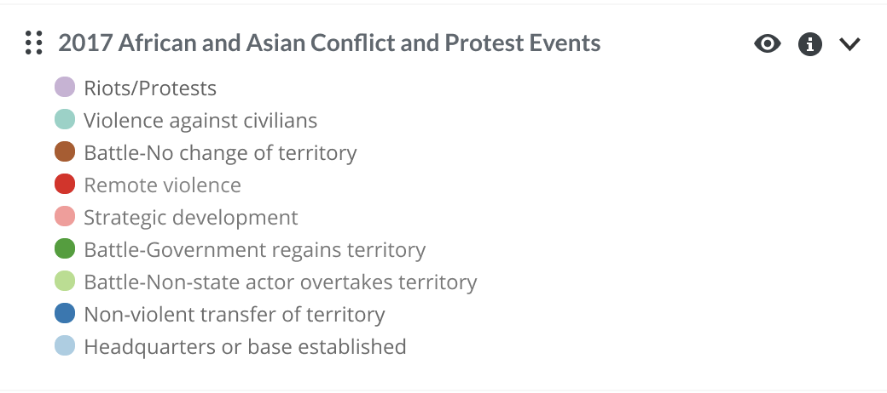
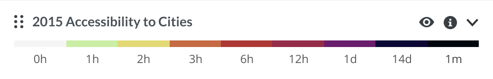
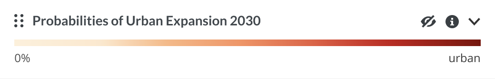
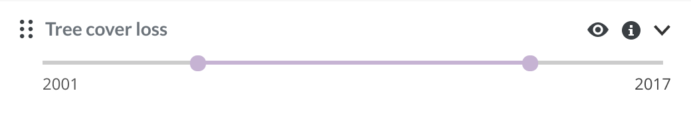

# Front-end-code-challenge

This repository contains the project requested in the front-end code challenge at Vizzuality. The objective to complete this challenge is to set up a simple React-based web application and implement the Legend component.

Production in [https://ruijadom.github.io/front-end-code-challenge/](https://ruijadom.github.io/front-end-code-challenge/)

- [Front-end-code-challenge](#front-end-code-challenge)
  - [How to use](#how-to-use)
    - [Instalation](#instalation)
    - [Run Project](#run-project)
    - [Build for Producion](#build-for-producion)
    - [Build for Producion](#build-for-producion-1)
  - [Features](#features)
    - [Webpack - Module Blunder](#webpack---module-blunder)
      - [Features](#features-1)
        - [Deploy GitHub-Pages](#deploy-github-pages)
    - [Babel - JavaScript Compiler](#babel---javascript-compiler)
      - [Features](#features-2)
      - [Production optimizations](#production-optimizations)
    - [Eslint](#eslint)
  - [TodoList](#todolist)

---

## How to use

### Instalation

```
npm install
```

### Run Project

```
npm start
```

### Build for Producion

```
npm run build
```

### Build for Producion

```
npm run deploy
```

---

## Features

### Webpack - Module Blunder

https://webpack.js.org/

Webpack configuration is define in **webpack.config.js**

#### Features

- **devtool**: Enables source-map generation in development mode.
- **entry**: Main file of our application.
- **output.path**: Root directory to store output files.
- **output.filename**: Filename pattern to use for script files.
- **output.publicPath**: Path to the root directory where the files will be deployed on the web server.

  I use Webpack DefinePlugin() to expose environment variables from the build environment to our application code.

  ```
  new webpack.DefinePlugin({
    'process.env.NODE_ENV': JSON.stringify(isProduction ? 'production' : 'development')
  })
  ```

  ##### Deploy GitHub-Pages

  To run correctly the application in GitHub-Pages i use a condition thath check if the host environment variable is define or not.

  ```
  const isProduction = argv.mode === 'production';
  const isDevelopment = !isProduction;
  ...
  publicPath: isProduction ? argv.host : '/'
  ...
  ```

  To make it easier to change paths, I have a file with the values ​​that are used in the webpack configuration in **config/paths.js**

  ```
  const path = require('path');
  const packageJSON = require('../package.json');

  module.exports = {
    // Webpack
    entryPath: path.resolve(__dirname, '../', 'src/index.js'),
    outputPath: path.resolve(__dirname, '../', 'dist'),
    templatePath: path.resolve(__dirname, '../', 'public/index.html'),
    faviconPath: path.resolve(__dirname, '../', 'public/favicon.ico'),
    outputScripts: 'scripts',
    outputStatic: 'static/media/'
  };
  ```

### Babel - JavaScript Compiler

https://babeljs.io/

Babel configuration is define in **babel.config.js**

#### Features

- **@babel/preset-env**: Is a smart preset that allows you to use the latest JavaScript without needing to micromanage which syntax transforms. Takes any target environments you've specified and checks them against its mappings to compile a list of plugins and passes it to Babel.
- **@babel/preset-react**: Transforms JSX syntax into plain-vanilla JavaScript function calls.
- **@babel/plugin-transform-runtime**: Reduces code duplication by extracting Babel helpers into shared modules.
- **@babel/plugin-syntax-dynamic-import**: Enables dynamic import() syntax in browsers lacking native Promise support.
- **@babel/plugin-proposal-class-properties**: Enables support for the public instance field syntax proposal, for writing class-based React components.

#### Production optimizations

- **babel-plugin-transform-react-remove-prop-types** removes unnecessary prop-types from production code.
- **@babel/plugin-transform-react-inline-elements** evaluates React.createElement during compilation and inlines the result.
- **@babel/plugin-transform-react-constant-elements** extracts static React elements as constants.

### Eslint

ESLint statically analyzes your code to quickly find problems.

---

## TodoList

- [x] Set up Project

  - [x] Install necessary modules
  - [x] Configure Babel
  - [x] Configure Webpack
  - [x] Set up project structure and Webpack config for work with SASS
  - [x] Run Application in Development Mode with source-map
  - [x] Build Dist Folder with code minification:
    - [x] [terser-webpack-plugin](https://webpack.js.org/plugins/terser-webpack-plugin/) for JavaScript
    - [x] [optimize-css-assets-webpack-plugin](https://github.com/NMFR/optimize-css-assets-webpack-plugin) for CSS

- [x] Create Legend component (dynamic data)

  - [x] Load json data

  - [x] Create 3 diferent legend item components

    - [x] Basic

      - 

    - [x] Cloropleth
      - 
    - [x] Gradient
      - 

  - [x] Create Icons SVG as component
  - [x] Create Toolbar component
  - [x] Create Tooltip component

    - Extra: [x] create Timeline legend item component

    - 

  - [x] Create Modal Component - Portals

- [x] Extra goals

  - [x] 1. Persist text in first layer - Persiste text in localstorage.
  - [x] 2. Sorte the layers.
  - [x] 3. Timeline

- [x] Deploy application in GitHub-Pages

---

author: Rui Domingues
